#       Best Books

This is the site where you will find the **best books to read**. Get inspired by 
other readers **recommendations, grades and tips**.
And you are of course **welcome to add your own reviews**, grades and tips.

The live project can be found here: [https://ms3-best-books.herokuapp.com/](https://ms3-best-books.herokuapp.com/)

|**Browser requirements** (at least version)|
|---------------------------|
|Chrome 58|
|Edge 14|
|Firefox 54|
|Safari 10|
|Opera 55|
|Opera mini can not be used|
|IE10|
|iOS 9|
|Android 4.4|

## Contents
- [UX](#ux)
  * [Strategy Plane](#strategy-plane)
    + [Site owner's goal](#site-owner-s-goal)
    + [External users goal](#external-users-goal)
  * [Scoope Plane](#scoope-plane)
    + [User stories](#user-stories)
    + [Features](#features)
  * [Structure Plane](#structure-plane)
  * [Skeleton Plane](#skeleton-plane)
    + [Wireframes](#wireframes)
      - [Major changes compared to wireframes](#major-changes-compared-to-wireframes)
        * [Home page](#home-page)
        * [Book Details/Manage book page](#book-details-manage-book-page)
        * [Reviews page](#reviews-page)
        * [Manage Category groups](#manage-category-groups)
    + [Database structure](#database-structure)
    + [Design Choices](#design-choices)
      - [Fonts](#fonts)
      - [Colours](#colours)
- [Features](#features-1)
  * [Existing Features](#existing-features)
  * [Responsive](#responsive)
  * [Features Left to Implement](#features-left-to-implement)
- [Technologies Used](#technologies-used)
  * [Languages](#languages)
  * [Frameworks, Libraries and Programs](#frameworks--libraries-and-programs)
  * [API (Application Programming Interfaces)](#api--application-programming-interfaces-)
- [Testing](#testing)
- [Deployment](#deployment)
  * [Local Deployment](#local-deployment)
  * [To deploy your project on Heroku, use the following steps:](#to-deploy-your-project-on-heroku--use-the-following-steps-)
- [Credits](#credits)
  * [Contents](#contents)
  * [Media](#media)
  * [Acknowledgements](#acknowledgements)

<small><i><a href='http://ecotrust-canada.github.io/markdown-toc/'>Table of contents generated with markdown-toc</a></i></small>


## UX
### Strategy Plane
#### Site owner's goal
- Earn money on each book purchased via link from the site.
- Get inspired from users reviews and recommendations.


#### External users goal
Find books they would like to read.

There are three types of users:
- Those who just want to get inspiration and find books to read: **Viewer**.
- Those who also want to add books to the site and share their thoughts
 about a book/books: **Reviewer**.
- The administrator of the page who manages book categories: **Administrator**.

**Site owners need**
- That it is easy for user to buy book: priority 1.

**Viewers and Reviewers** needs:
- Easy and intuitive way to browse books: priority 1.
- Easy find more information about a book: priority 2.
- Buy book/s. 
- See what other users think about book: priority 2.

**Reviewers** needs:
- Easy search for a book and add book that is not present on site: priority 2.
- Easy grade and give review of book: priority 2.
- Update and remove "own books" (books that user has added) :  priority 3.
- Update and remove "own reviews" (reviews that user has added): priority 3.

**Administrators** needs:
- Authority to edit and remove all ideas of all users: priority 3.
- Authority to manage categories: priority 3.

### Scoope Plane
#### User stories
(this is not in prioritization)
- US_001: As a user I want to search for books in the database.

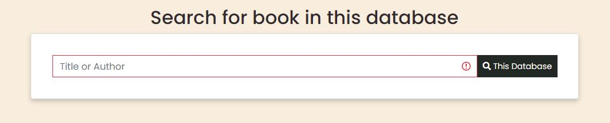 
- US_002: As a user I want to see detailed information about a book.

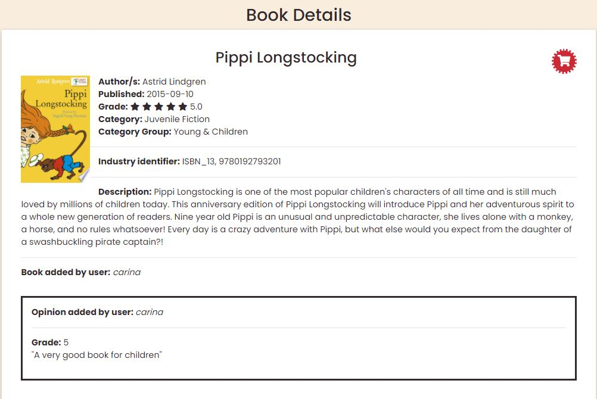
- US_003: As a user I want to buy a book. 
It is possible to buy book from four places on the site
(this is a high priority for site owner):


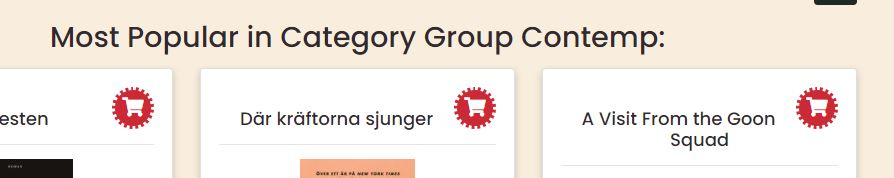


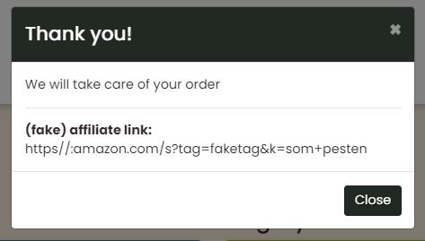
- US_004: As a user I want to see which books are most popular on the site.

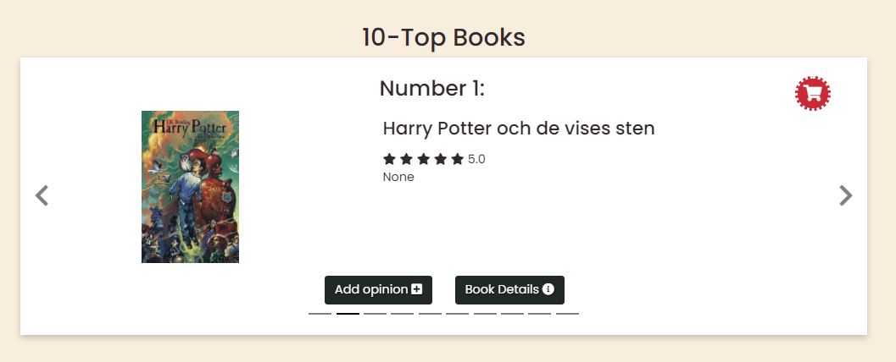
- US_005: As a user I want to look for most popular books in a category.

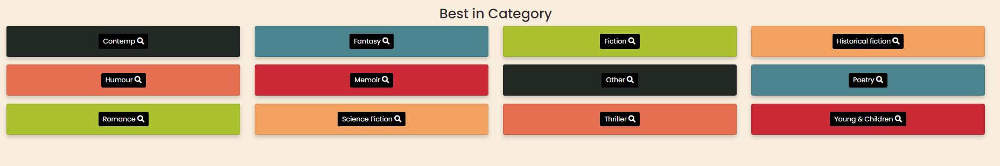

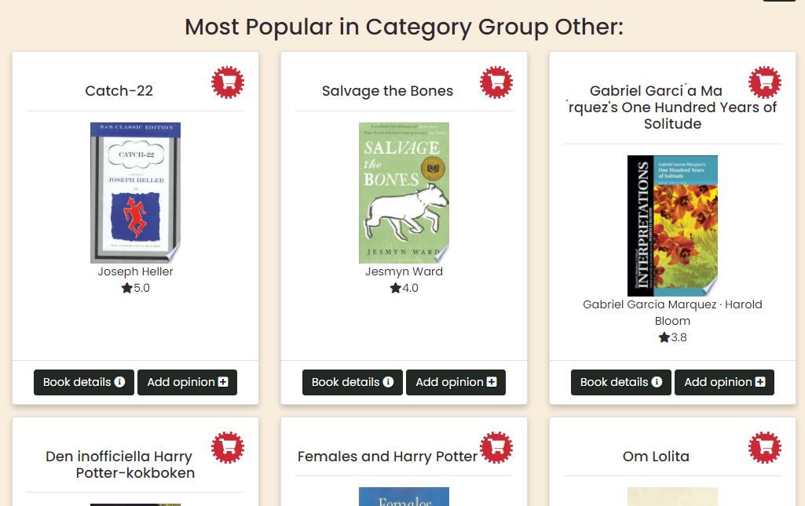
- US_006: As a user I want to add book to the site.

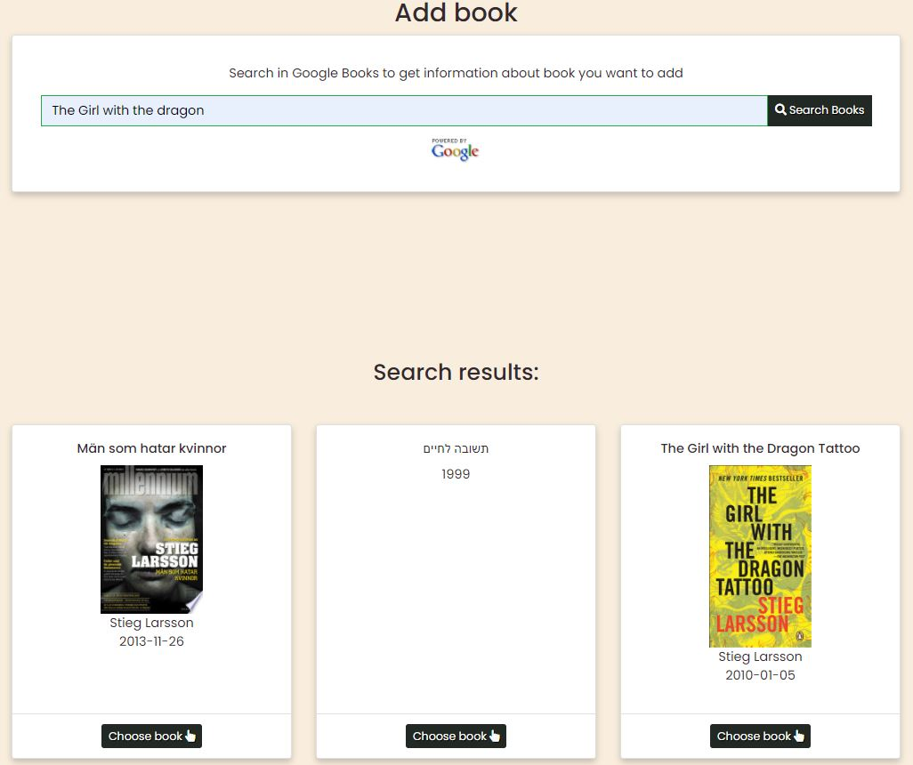

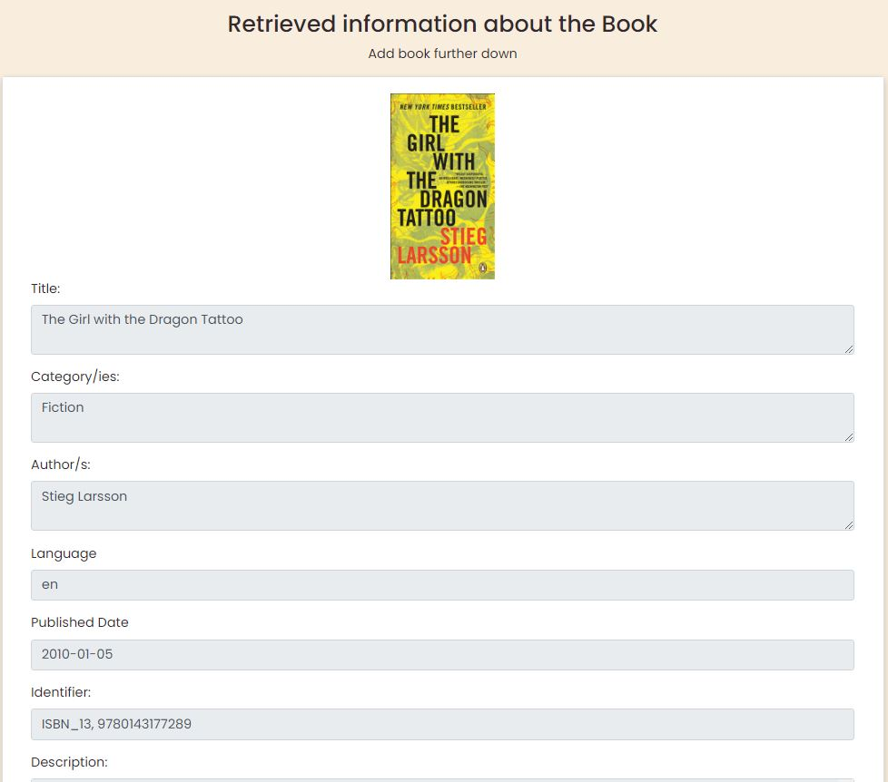

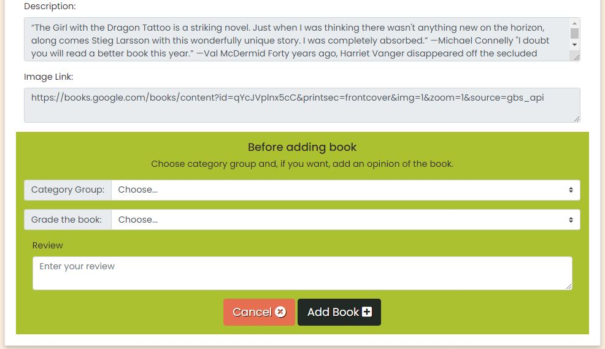
- US_007: As a user I want to edit information about the book.
    - Notice! This user story is not implemented yet.
- US_007: As a user I want to remove book.

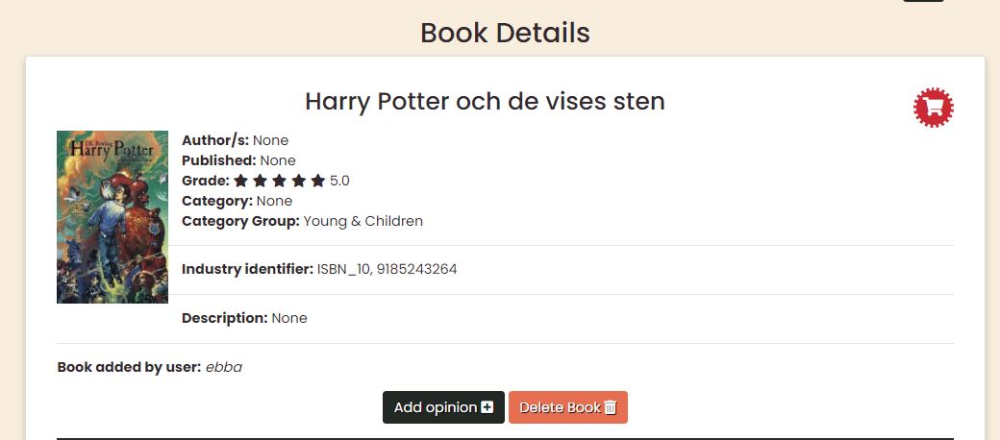
- US_008: As a user I want to grade a book.
- US_009: As a user I want to give a review of a book.


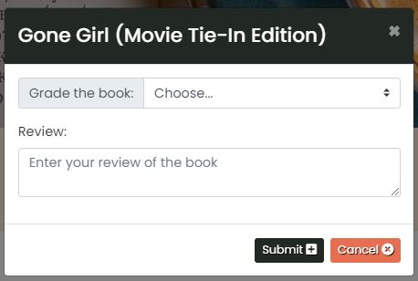
- US_010: As a user I want to edit my opinion of a book.
- US_011: As a user I want to remove my opinion of a book.

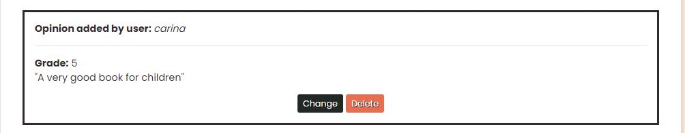

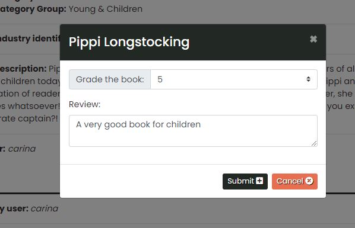
- US_0012: As a user I want to register (sign up) to the system.

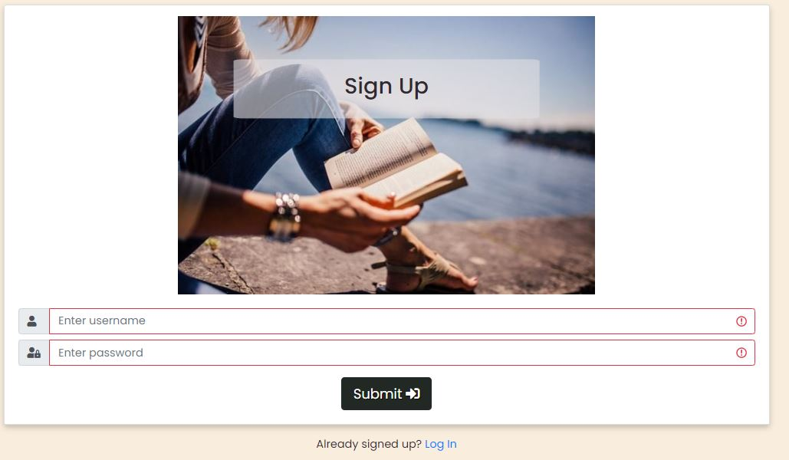
- US_0013: As a user I want to log in to the system.

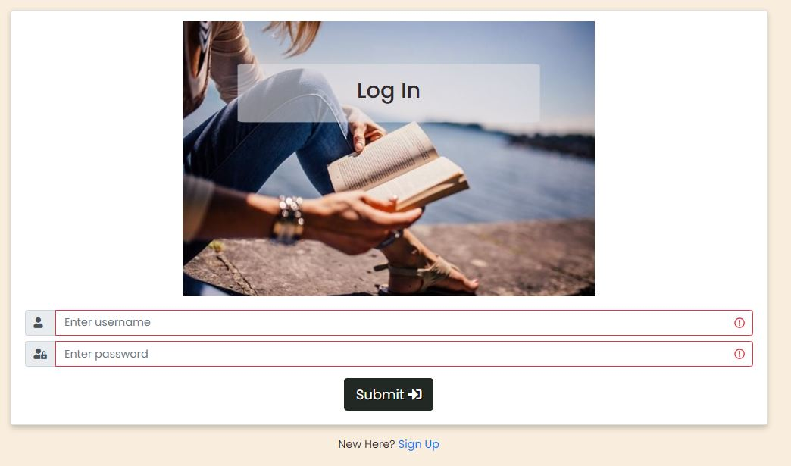
- US_0014: As a user I want to log out of the system.


- US_0015: As a "administration" user I want to add categories.
- US_0016: As a "administartion" user I want to remove category
- US_0017: As a "administration" user I want to edit category.

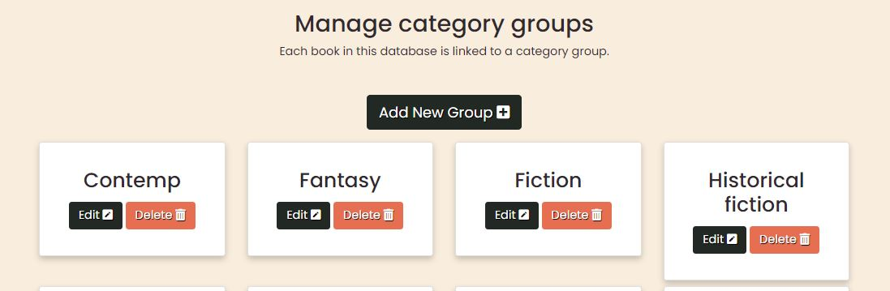

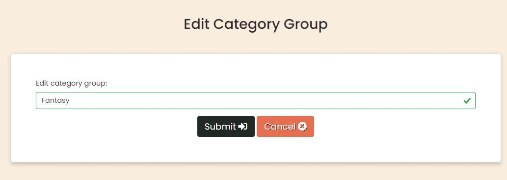

#### Features
- Search for books. 
- Search for books belonging to category.
- Easy to buy a book with a link.
- Overview: many books with limited information for each book.
- Possibility to easily get more detailed information about a book.
- Add, edit and remove a book.
- When adding a book: "help" to "automatically" fill in information about the book.
- Add, edit and remove review and grade for a book.
- Authentications system: User can only edit and remove "own books" and 
"own reviews".
- Add, edit and remove categories. Authentication system limits this
capability to those with administator privleges.

### Structure Plane
The site starts with the homepage:  where you can search and find books.
- From navbar you can choose to got to homepage by clicking the Brand-image, 
Register, Log In, Log Out, see 10-top books, see best books for category group,
search for book, add book and Manage Category groups, 
all depending on your authorities.
- In Home page you can:
    - search for books either:
        - in 10-top list
            - from this list you reach Book details and/or add opinion.
        - in best in category
            - the result is presented in search result page
        - by giving title or author
            - the result is presented in search result page
    - "Add Book": User search with title or author and gets suggestions from system
    that user choose between. After adding a book user is moved to 
    "Book details/Manage Book" page.
- In search result page:
    - You can choose a book and go to Book details or Add opinion
- In Book Details page:
    - You can:
        - Delete book
        - Add opinion
        - Change or delete opinion

- "Register", "Log In" and "Manage Categories" has separate pages.

Here is a visual of the structure:


### Skeleton Plane
- The user browses via navigation system.
- User searches for book/s by giving book title or author or part of it.
- User can filter search by giving categories
- Interactive design that works on Mobile, Tablet as well as Desktop.
#### Wireframes
- [Mobile](https://github.com/Carina-P/ms3-best-books/blob/master/wireframes/wireframe-mobile.pdf)
- [Tablet](https://github.com/Carina-P/ms3-best-books/blob/master/wireframes/wireframe-tablet.pdf)
- [Desktop](https://github.com/Carina-P/ms3-best-books/blob/master/wireframes/wireframe-desktop.pdf)

##### Major changes compared to wireframes
###### Home page
- Moved search for book further down. Prioritized to show most popular books
since it is high priority that users buys a book and I think that showing most
popular books might inspire to spontaneous purchases.
Someone who wants to search for a book probably do not mind moving further down
the page.
- Most Popular books: Shows one book at a time, in the carousel, instead of several. Talked to
users who thought it was more clear and appealing this way.
- Search result/Category X: The search is shown in own page, instead of on the home page.
This is due to clarity for the user and a more clean code.
- Add Book: One more step to add a book: After user choosen which book to add, a form with all
book information is shown. The forms layout is very similar to the Book details page. 
One more step is needed because I want to show all information that is saved for the book,
make user add a categroy group to the book and also give user opportunity to add grade and 
review instantly.

###### Book Details/Manage book page
- Book information is not exactly the same in page as in wireframe.
- User can not change Book Information. The button: Edit book info, is removed. Information for 
a book is fetched from Google Books and as I understand Google Books policy, user is not allowed 
to change information fetched from them. But category group is not fetched from Google Books 
so in a futher version of Best Books changing category group should be added. Books grade
and reviews can be changed.
- Up to five reviews are shown in this page. If book has more reviews than that: link to 
reviews page is shown.

###### Reviews page
- This page has not got a wireframe.
- When talking to UI-testers it was decided that for most of the time only the five last 
reviews is interesting. So in Book Details page only up to five reviews are shown. 
This makes the page more clear. 
- User has oppotunity to click on link, from Book details, to Reviews page to
see all reviews, if more than five exists.
- This page is designed as the layout of reviews in Book Details page.

###### Manage Category groups
- Using cards in card deck instead of table.

#### Database structure
According to project instructions the document-based 
database MongoDB is used. Here is a **visual of the collections**:


- Both books and books_details contain information about books. I decided to 
divid the information into two collections using the **subset pattern**
([Mongo DB Documentation](https://docs.mongodb.com/manual/tutorial/model-embedded-one-to-one-relationships-between-documents/))
The information in books collection is accessed often from the page but information in the books_details
collection is less frequently-accessed.
- The **subset pattern** 
([MongoDB Documentation](https://docs.mongodb.com/manual/tutorial/model-embedded-one-to-many-relationships-between-documents/)) 
is also used for book_details and reviews collections.
It is possible to add a huge amount of reviews and I deceided to embed the five 
latest reviews in the books_details collection.
This five (or fewer if less reviews) reviews will be shown together with the 
book details. User can choose to see more reviews and then all
reviews are fetched from review collection.

#### Design Choices
##### Fonts
For this project the Google Font **Poppins** is choosen. Poppins is a newcommer in
the geometric sans serif typefaces tradition. It is a rounded and modern fontawesome
that I think feels friendly and fits on this site.
As alternative Google Font Roboto is choosen.

##### Colours
This is the colours used:


**Text and background**
Text: mostly Black #000000
Background: mostly White, #ffffff
Choosen this colours as they give optimal contrast.

Text on black background, in navbar and buttons are white: #ffffff.

**Extra attention**
As buying books has a high priority the background for buying-icon is:
Madder Lake, #cc2936
Red is an optimistic colour that draws attention to it and makes people buy.

**Messages**
I wanted a "distinct colour" that makes user look, for the background of
messages. I chosed:
Acid Green, #acc12f

**Navbar and buttons**
Navbar: dark djungle green, #222823
Buttons:
    - Dark Jungle Green, #223823
    - Burnt Sienna, #e76f51

**Category groups background**
I want something to make the page more "dynamic" and decided to have
different background colours behind the category groups on home page.
I am "reusing" some colours:
- Madder Lake, #cc2936
- Acid Green, #acc12f
- Dark Jungle Green, #223823
- Burnt Sienna, #e76f51

Some of the above colours are "autumn colours" to me so I added another
autumn colour:
- Sandy Brown, #f4a261
And a colour from the start image:
- Metallic Seaweed, #4b838e

## Features
### Existing Features
- Features in all pages:
    - **Messages** to the user is shown in top of current page, with an "acid green" background colour.
        - **template**: templates/components/messages.html

        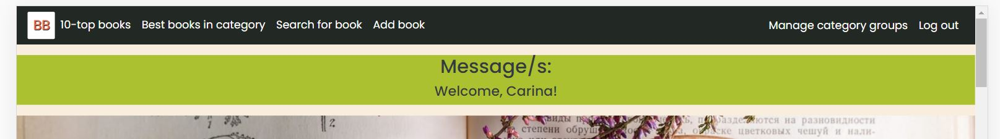
    - **Header**:
        - logo and navbar fixed at the top of viewport:
            - **template**: templates/layouts/navigation.html
            - **logo**: When hover over, it becomes larger
            - **navbar**: When hover over links, the color changes
            - If **medium and smaller**  viewport widths: links are collapsed to a "hamburger" menu.

        

        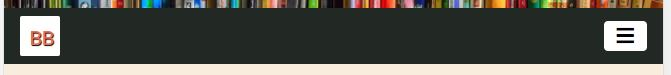
    - **Footer**: 
        - **template**: templates/layouts/footer.html
        - In bottom of page with **social links**.

    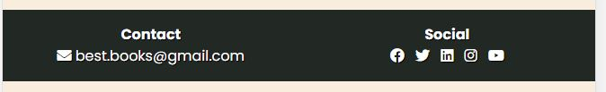


- **Home - page** and other pages reached from the home page:
    - **template**: templates/pages/home.html
    - **Start**, Welcome on a background image:
        - Short introduction to the site

    
    - **Top ten** most popular books in a **carousel**:
        - **template**: templates/components/carousel.html
        - Possibility to **buy the book**: In top right corner is a read shopping cage with a link. 
        Hoovering the link makes picture larger.        
        - Possibility to link to more **details of the book**
        - If user i logged in also possibility to **add opinion** about the book.

    
    - **Best in category**:
        - All **category groups** present in database is shown with **different background colours**.
        - **template**: templates/components/components/cards/card_best_category.html

        
        - Possibility to **click on a category group** and then user is moved to **result-page** that shows
        **most popular books within choosen category group**.
        - If **no book** in database is attached to the category group - a **message** is shown in top of page.
    - **Search for book in database**:
        - A **search-form** where user can print title/part of title, author or part of authors name and then search
        for books. Result is shown in **result-page**. The link to submit the search is called "Search Book" and this 
        is according to Google Books [Branding Guidlines](https://developers.google.com/books/branding): 
        "You may only use the verbs "Search," "Search Books," or "Search in this book" 
        when prompting users for action that results in an API query (e.g., on a form 'submit' button)." 

        
        - If **no book** in database **matches** the search - a **message** is shown in top of page.
    - **Add book** - this feature is only available to users that are logged in:
        - Interactive logic in **JavaScript**': static/js/script.js
        - User do not have to know all information about a book. Instead user **searches in the API: Google Books**
        for the book with information to add to the database.
        - A **search-form** where user can print title/part of title and or author/part of authors name.
        - The **resulting books** matching the search-criteria is **shown below** the search-form when user clicks search or 
        presses return. User is moved to the place.

        
        - The user continues with choosing which book he/she is interested in adding. When book is choosen, 
        **more details about the book** is shown, in a **form**, further down. And user is moved to this place.
        - **Finally** the user chooses a **category group** that book should be attached to in this database. User can also, voluntarily,
        **add a grade and a review** of the book before submitting to the database.
        - If user does not want to add book - he/she can click on **Cancel** and the information is removed and user
        redirected to the search-form for adding book.

        

        

- **Search result - page**:
    - **template**: templates/pages/search_result-html
    - User ends up at this page when either:
        - looking for **most popular** books belonging to a **category group** or
        - **searching** for a book **in this database**
    - **"Card deck"** of books i shown with:
        - Possibility to **buy** each book.
        - **Title, image of cover, author/s** and 
        - Information which **average grade** book is given in this database.
        - Possibility to go to **"book-details page"** with more information about choosen book.
        - If user has logged in - there is also a possibility to **add opinion** of the book.
    - **Close-Button** in top right corner takes user back to home-page.
    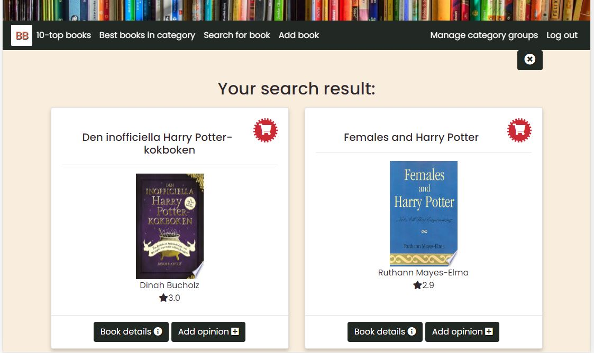

- **Book details - page**:
    - **template**: templates/pages/book.html
    - User ends up at this page when choosing **"Book Details"-button** either in top-ten **carousel** or
    in **book-card** in search-result page.
    - The following information of the book is shown:
        - **Title**
        - **Image of book cover**
        - **Author/s**
        - **Published date**
        - **Average grade** in this database. Grade is also represented by  **filled stars**.
        - **Category in Google Books**
        - **Category group** choosen for the book by user who added the book.
        - **Identifier**
        - **Description**
        - Username of **user who added the book**.
    - Up to **five** of the **latest opinions** given to the book is shown, with information:
        - Of **who** gave the opinion
        - **Grade** given
        - And the **review** given
    - If **more than five opinions** is give to the book:
        User is given opportunity to go to **opinions-page** with all opinions given to the book.

        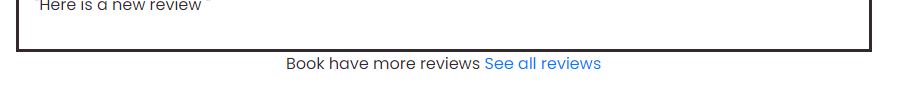
    - User who has added the book can also **delete** it. When book is deleted all opinions about the book are also deleted.
    - It is possible to **add an opinion**:
        - When this alternative is choosen an **add opion modal** is shown.
    - User who has added an opinion can also **edit or delete the opinion**.
    - If **Edit opinion** is choosen an **edit opinion modal** is shown.
    - **Close-Button** in top right corner takes user back to home-page.

    
    

- **Opinions - page**:
    - **Template**: templates/pages/opinons.html
    - User ends up at this page when **"See all opinions"** is choosen in "Book details page".
    - All opinions of current books is shown, with information about:
        - **Who** has given the opinion
        - **Grade** given
        - **Review** given.
    - **User who has added the opinion** has the possibilities to:
        - **Change** review
        - **Delete** review

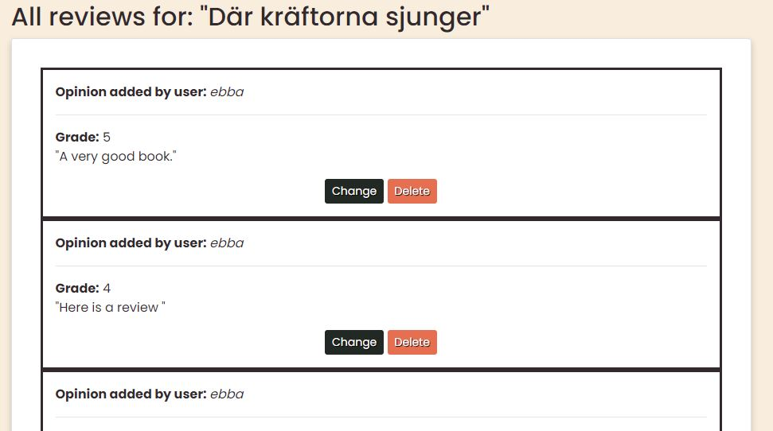
- **Add opinion - modal**:
    - **Template**: templates/components/modals/modal_general.html and
        templates/components/modals/modal_body_opinion.html
    - Modal contains:
        -  Book **title**
        - **select-list** (1 to 5) for **grading** the book
        - text-area for the **review** to be given in
    - When information is submitted:
        - if a grade is given a new average grade is calculated for the book and average grade for book in 
        database is updated.
        - Opinion is added to the database.
        - user is directed to page, which is updated the added opinion, modal was called from.
    - If modal is closed without submitting, user is returned to page where it was called from and no
    updating of database takes place.

    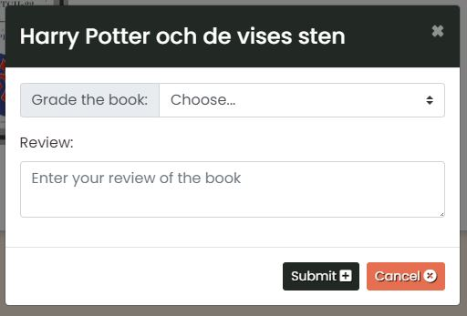

- **Edit opinion - modal**:
    - **Template**: templates/components/modals/modal_general.html and
        templates/components/modals/modal_body_opinion.html
    - Modal contains:
        -  Current books **title**
        - **select-list** with **grade** given to the book
        - text-area with given **review**
        - Grade and/or review can be changed.
    - When information is submitted:
        - If grade is changed a new average grade for book is calculated and updated in the database.
        - Grade and/or review is updated in database.
        - user is directed to page, which is updated with changed grade and/or review, modal was called from.
    - If modal is closed without submitting, user is returned to page where it was called from, and no updating of database occurs.

    
- **Authorisation - pages**:
    - **Template**: templates/pages/authorisation.html
    - **Log In** and **Sign in** are similar including:
        - **Form** where user can give:
            - **Username** and
            - **Password**
        - **Submitting**:
            - **Password** sent over internet and stored in database, is **hashed**.
            - **Sign In, username is checked** if it already exists. If it does, user is informed and
            **returned to sign In page**. If username does not exist - user is **logged in and redirected to home page**.
            - **Log in, username and password is checked**. If they does not exists or password is 
            wrong: user is informed and **returned to login page**. If correct user is **redirected to 
            home page**.
        - Possibility to go to Sign up and Log in page respectively.

        
        
        

- **Manage Categories - pages**:
    - Notice: The category group **Other** can not be changed or deleted.
    - At the moment, anyone who has logged in, can reach this pages. In the future **only users, with
    authority** is allowed to use these pages. And the users, with given authority, are supposed be more experienced 
    of this site and know what to do. **First time users** might be **confused** by what "Managing category groups"
    means.
    - **Category groups - page**:
        - **Template**: templates/pages/category_groups.html
        - A page with all category groups represented in a **"card deck**.
        - User can **add a category group** by clicking on link. User is then redirected to "Add category group page"
        - For each category group user can:
            - **Edit** category group, by clicking on link and is then redirected to "Edit category group page" 
            - **Delete** category group. If category group is deleted. All **books** in database that are **attached to 
            deleted category group** is updated with the category group: **Other**.
    - **Add category group - page**:
        - **Template**: templates/pages/category_group.html
        - A **form** where user types new category groups name.
        - When form is submitted, new category group is added to the database and user redirected to "Category groups page".
        "Category groups page" is updated with the new category group.
        - If user clicks on cancel, he/she is returned to "Category groups page".
    -**Edit category group - page**:
        - **Template**: templates/pages/category_groups.html
        - A **form** where current category groups name is given.
        - User can edit the name and click on the **Submit-button**. When changed name is submitted:
        Database for all **books attached to category groups name is updated** to the changed category groups name.

    
    
    

### Responsive
The site is design to fit devices with screen width from **300px** and larger.
The following features are designed differently for different devices:
- **Navbar**: On screen widths **smaller** than 992px the navbar **collapses**
into "hamburger" menu.
- In **carousel on home page**: On devices with a width **larger than 768px** book information
is shown beside image of book cover and average grade is represented by stars. On smaller 
devices the information is shown below the book cover and the average grade is only shown as a number.
- When content is shown in **"card deck formation"**, number of **columns** change 
**depending on viewport size**, the larger screen width the more columns. This applies to:
    - Best in category buttons (with coloured background) on home page.
    - Information about books resulting from search to add book on home page.
    - Information about books resulting from search for books in sites database and searching
    for books that are best in specific category. The result is shown in search result page.
    - The different category groups shown in category groups page.
    in search result page.
- **"Instruction"** in beginning of home page is **wider on smaller viewports**. And that also
applies to the width of the **carousel** on the home page.
- On **very small devices** (width less than 400px) the **font size is 14px**.


### Features Left to Implement
- Whenever user **deletes** a book or an opinion a question of **"are you sure"** should be answered before deletion takes place.
- Implementing **authorisation for managing category groups**. Only a few selected user should be able to do this.
- Ability to **change category group** attached to a book. No other book information can be changed, since the information is
fetched from Google Books API. That is how I interpret the Google Books [branding policy](https://developers.google.com/books/branding).
- It is easy to replace modal with an real **affiliate link** when clicking on buy a book.
- Add **indexes** to the database to speed up searching.
- Put **image of book cover in add opinion-modal**, especially when choosing add opinon from book in carousel in home page. since
carousel continues "moving" behind the modal, perhaps user gets confused which book, opinion is added to. Notice: Books titel is
given in modal and that is why this feature is not prioritized.

## Technologies Used

### Languages
- [HTML](https://developer.mozilla.org/en-US/docs/Web/HTML) 
    - To structure the web content
- [CSS](https://developer.mozilla.org/en-US/docs/Web/CSS) 
    - to describe the web page's appearance/presentation
- [JavaScript](https://www.javascript.com/)
    - Bringing interactivity and logic to the site.
- [Python]((https://www.python.org))
    - to manage logic and information on server side

### Frameworks, Libraries and Programs
- [GitPod](https://gitpod.io/)
    - used for version control by utilizing the GitPod terminal to
    commit to Git and push to GitHub and Heroku.
- [Heroku](https://www.heroku.com/home)
    - to host the web app
- [GitHub](https://github.com)
    - GitHub is used to store the code.
- [Bootstrap](https://getbootstrap.com/)
    - A helpful HTML, CSS (and JS) library that is great for responsive design.
- [JQuery](https://jquery.com/)
    - The project uses **JQuery** to simplify DOM manipulation.
- [JSON](https://www.json.org/json-en.html)
    - A data-interchange format used when retrieve information from other 
    sources as Google Books.
- [Fetch API](https://developer.mozilla.org/en-US/docs/Web/API/Fetch_API)
    - Fetch API provides an interface for fetching resources. In this project
    it is used for fetching data across the network.
-[MongoDB](https://www.mongodb.com/cloud/atlas)
    - database used in this project
- [Flask](https://flask.palletsprojects.com/en/1.1.x/)
    - a micro framework that makes it easy to manage databases from python
- [Werkzeug](https://werkzeug.palletsprojects.com/en/1.0.x/)
    - used in this app for authentication
- [Jinja](https://jinja.palletsprojects.com/en/2.11.x/)
    - for templating logic
- [JSHint](https://jshint.com)
    - to validate JavaScript code
- [Markup Validation Service](https://validator.w3.org)
    - to validate HTML code
- [CSS Validation Service](https://jigsaw.w3.org/css-validator/)
    - to check CSS
- [Font-Awesome](https://fontawesome.com/icons?d=gallery)
    - From this library the icons are fetched 
- [Google fonts](https://fonts.google.com/)
    - For inspiration and fonts
- [Balsamiq Wireframes](https://balsamiq.com/)
    - For designing the wireframes
- [Coolors](https://balsamiq.com/)
    - To generate color-schemes
- [Favicon](https://favicon.io/)
    - to generate Favicon
- [ImageOptim](https://imageoptim.com/api)
    - To optimize images to load faster. 

### API (Application Programming Interfaces)
- [Google Books](https://developers.google.com/books)
    - Provides information about books. In this way user conveniently gets all
    information about book, he/she wants to add to this site, automatically.

## Testing
"All tests passed without major issues?
The tests conducted are detailed in [TESTS.md](https://github.com/Carina-P/ms3-best-books/blob/master/TESTS.md)

## Deployment
### Local Deployment
Best Books was developed on **GitPod**, using **git** and **GitHub** to host the
repository. The project is deployed to **Heroku**.

This project can be ran locally by following these steps: (This are specific to GitPod, adjust them
depending on your IDE.)

1. Clone the project:
- Log in to **GitHub** and locate **[Best Books Repository](https://github.com/Carina-P/ms3-best-books)**
- Under repository name, locate **"Code"** and click on it.
- To the top right: locate green button called **"Code"** and click on the
button. 
- Then there are some choices:
    * Checkout with **SVN using web URL**: 
        * Copy the **url** shown or copy this: 
        https://github.com/Carina-P/ms3-best-books.git 
        * Use the url to import the code into your favourite **IDE**. Note that
        different Code Editors have different processes for making the clone. 
    * Using **GitHub Desktop**:
        * Save the clone directly by chosing **"Open with GitHub Desktop"**
    * Downloading **zip file**:
        * Select **"Download ZIP"** and all the files will be saved, zipped, to
        local computer.  

Alternatively, you can clone the repository using the following line in your terminal:

    ``` 
    git clone https://github.com/Carina-P/ms3-best-books.git
    ``` 

2. Access the new folder in your terminal window and **install** the application's **required modules**

    ```
    pip3 install -r requirements.txt
    ```

2. **Sign-in** or sign-up to **[MongoDB](https://www.mongodb.com/)** and create a new cluster
    -  Within the Sandbox, click the collections button and then click **Create Database** (Add My Own Data) called **best_books**
    - **Set up** the following **collections**: books, books_details, category_groups, reviews and users. 
    Collections are shown in chapter: Database structure [Go to Database structure](#database-structure)
    - Under the **Security Menu** on the left, **select Database Access**.
    - **Add a new database user**, and keep the credentials secure
    - Within the **Network Access** option, **add IP Address** 0.0.0.0

3. In your IDE, **create** a file containing your environmental variables called **env.py** at the root level of the application. 
    It has to contain the following lines and variables:
    ```
    def env():
        import os

        os.environ.setdefault("IP", "0.0.0.0")
        os.environ.setdefault("PORT", "5000")
        os.environ.setdefault("SECRET_KEY", "YOUR_SECRET_KEY")
        os.environ.setdefault(
            "MONGO_URI", "YOUR_MONGODB_URI"
        )
        os.environ.setdefault("MONGO_DBNAME", "best_books")
        os.environ.setdefault("IS_DEBUGGING", "YES")
    ```

    Please note that you will need to **update "YOUR_SECRET_KEY"** with your own secret key, as well as the **"YOUR_MONGODB_URI" variable** with those provided by MongoDB.
    To find your MONGO_URI, go to your clusters and click on connect. Choose connect your application and copy the link provided. 
    Don't forget to update the necessary fields like password and database name.

    If you plan on pushing this application to a public repository, ensure that **env.py is added to your .gitignore file**.

4. **The application can now be run locally**. In your terminal, type the following command 
    ```
    python app.py 
    ```
    
### To deploy your project on Heroku, use the following steps: 

1. **Login** to your Heroku account and **create a new app**. Choose your region. 
2. Ensure the **Procfile** and **requirements.txt** files exists and up-to-date in your local repository.  
    Requirements:
    ```
    pip3 freeze --local > requirements.txt
    ```
    Procfile:
    ```
    echo web: python app.py > Procfile
    ```
3. The Procfile should contain the following line:
    ```
    web: python app.py
    ```

4. Scroll down to **"deployment method"-section**. Choose **"Github" for automatic deployment**.
5. From the inputs below, make sure your **github user is selected**, and then enter **your repo name**. Click "search". When it finds the repo, click the **"connect" button**.
6. Scroll back up and **click "settings"**. Scroll down and **click "Reveal config vars"**. Set up the same variables **as in your env.py** 
(IP, PORT, SECRET_KEY, MONGO_URI, MONGODB_NAME) except IS_DEBUGGING. **NOTICE! Do not set IS_DEBUGGING or set it to ""**. You do not want debugging in a production environment.

    ```
    IP = 0.0.0.0
    PORT = 5000
    SECRET_KEY = YOUR_SECRET_KEY
    MONGO_URI = YOUR_MONGODB_URI
    MONGO_DBNAME = DATABASE_NAME
    IS_DEBUGGING = ""
    ```

7. Scroll back up and **click "Deploy"**. Scroll down and **click "Enable automatic deployment"**.
8. Just beneath, **click "Deploy branch"**. Heroku will now start building the app. When the build is complete, **click "view app"** to open it.
9. To push changes to Heroku:
    - In terminal window give the command **git push** to push your changes. 

## Credits
### Contents
Book information is fetched from the API: [Google Books](https://developers.google.com/books)

### Media
- The photos used in this site were obtained from [pixabay](https://pixabay.com/)
    - Picture in start page, a book and a cup of coffee, photographer: [Daria-Yakovleva](https://pixabay.com/sv/users/daria-yakovleva-3938704/?utm_source=link-attribution&amp;utm_medium=referral&amp;utm_campaign=image&amp;utm_content=2151200)
    - Picture in above navbar on some pages, part of bookshelf, photographer: [Lubos Houska](https://pixabay.com/sv/users/luboshouska-198496/?utm_source=link-attribution&amp;utm_medium=referral&amp;utm_campaign=image&amp;utm_content=1204029")
    - Picture in authorisation page, of a woman reading by the sea, photographer: [StockSnap](https://pixabay.com/sv/users/stocksnap-894430/?utm_source=link-attribution&amp;utm_medium=referral&amp;utm_campaign=image&amp;utm_content=925589)
### Acknowledgements
I received inspiration and help for this project from: 
- Help from above all: [w3.schools.com](https://www.w3schools.com/) and
[stackoverflow](https://stackoverflow.com/questions)
- I got some inspiration to the deployment section in this document from 
[Dog-Health-Tracker](https://github.com/AnoukSmet/Dog-Health-Tracker) 
made by [AnoukSmet](https://github.com/AnoukSmet)  
- A big Thank you! to my mentor [Simen Daehlien](https://www.github.com/eventyret) who
has inspired me and given me lots of tips as for example how to structure templates for reuse and clarity.